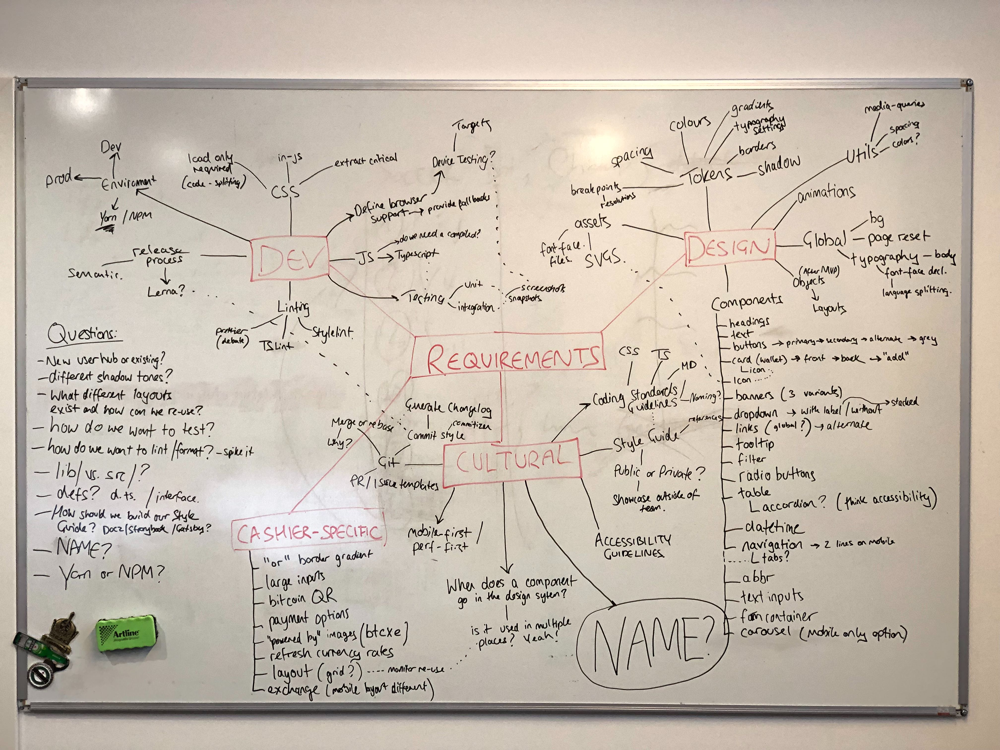

# Sportsbet.io Design

[](http://commitizen.github.io/cz-cli/)
[](https://lernajs.io/)
[](https://circleci.com/gh/coingaming/sportsbet-design)

## Contents

1. [Architecture](#architecture)
2. [Installation](#installation)
3. [Usage](#usage)
4. [Contributing](#contributing)
5. [Plan](#plan)

---

## Architecture

Our Design System is a [Lerna](https://github.com/lerna/lerna) monorepo that follows the [Smoothie](https://smoothie-css.com/) methodology, publishing key layers as individual `packages/`:

1. [**Assets**](packages/assets/README.md) - common rich media brand assets.
2. [**Tokens**](packages/tokens/README.md) - raw data values that define the Sportsbet.io visual language.
3. [**Global**](packages/global/README.md) - a tiny, crucial set of global styles to provide a solid and consistent foundation.
4. [**Utils**](packages/utils/README.md) - suite of tools to quickly access common token values.
5. [**Components**](packages/components/README.md) - the individual building blocks of our UI.

Packages are developed inside their respective `src` folders, utilising [Yarn Workspaces](https://yarnpkg.com/lang/en/docs/workspaces/) for dependency linking/sharing. Distributable code is generated in each package's `lib` by the [TypeScript compiler](https://www.typescriptlang.org/docs/handbook/typescript-in-5-minutes.html#compiling-your-code) on build/publish.

## Installation

### Prerequisites

- [Yarn](https://yarnpkg.com/en/docs/install#mac-stable)

### Setup

1. Install the above [prerequisites](#prerequisites).
2. Clone the repository:

   ```sh
   git clone git@github.com:coingaming/sportsbet-design.git
   ```

3. Install dependencies and link local packages together:

   ```sh
   yarn
   ```

## Usage

- `yarn commit` - CLI to write git commits in our [preferred format](CONTRIBUTING#commits).
- `yarn build` - compiles a distributable `lib` folder for each package.
  - Additional [TypeScript compiler options](https://www.typescriptlang.org/docs/handbook/compiler-options.html) can be appended to the command.
- `yarn format` - [Prettier](https://prettier.io) alias.
- `yarn lint:ts` - lint TypeScript in each package that contains it.
- `yarn test` - runs the [Jest](https://jestjs.io) testing suite.
  - Obsolete tests can be updated via the additional `-u` flag.
  - Additional [Jest options](https://jestjs.io/docs/en/cli) can be appended to the command.
- `yarn clean` - removes all generated `lib` folders.
- `yarn nuke` - removes all generated `lib` folders **and** `node_modules`.
- `yarn publish` - bumps package versions based on the [conventional commits specification](https://github.com/lerna/lerna/tree/master/commands/version#--conventional-commits) and publishes.

### Style Guide

Our project's style guide is built using the [Docz](https://www.docz.site) framework, and can be run as follows:

- `yarn docz:dev` - spins up a hot reloading Docz environment at [127.0.0.1:3000](http://127.0.0.1:3000/).
- `yarn docz:build` - generates a static production build of the style guide in `.docz/dist`.
- `yarn docz:serve` - serves files created by the build script.

### Cashier

All scripts defined in [packages/wip-cashier](packages/wip-cashier/README.md) can be run via `yarn cashier <script-name>`.

See the [Cashier README](packages/wip-cashier/README.md) for more details.

## Contributing

See the [Contributing Guidelines](CONTRIBUTING.md) for full info.

## Plan

Initial brainstorm of the project's requirements on Tuesday 8th January 2019:


